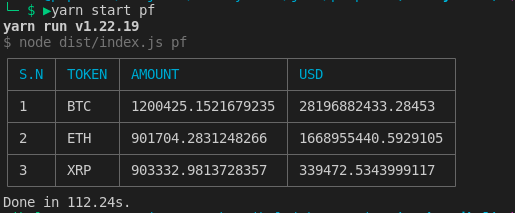
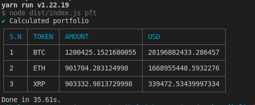

# Portfolio Calculation

Simple CLI application to calculate portfolio from CSV.

## Tech Stack

1. Node.js (>=16)
2. Typescript

## Project setup

### Prerequisite

1. [Node.js (>=16)](https://nodejs.org/en/)
2. [yarn](https://yarnpkg.com/)

### Installation

1. Clone the repo
   ```sh
   git clone git@github.com:maskeynihal/propine-test.git
   ```
2. Install the dependencies
   ```sh
   yarn install
   ```
3. Get API key of [CryptoCompare](https://min-api.cryptocompare.com/)
4. Copy .env.example to .env and setup the API key

   ```sh
   cp .env.example .env

   #.env
   CRYPTO_COMPARE_API_KEY=<API_KEY> #Update the key
   ```

5. Download [CSV](https://s3-ap-southeast-1.amazonaws.com/static.propine.com/transactions.csv.zip) file

   ```sh
   wget https://s3-ap-southeast-1.amazonaws.com/static.propine.com/transactions.csv.zip
   ```

   > You can add your own csv file too. It should have following headers

   1. timestamp: Integer number of seconds since the Epoch
   2. transaction_type: Either a DEPOSIT or a WITHDRAWAL
   3. token: The token symbol
   4. amount: The amount transacted

6. Unzip the csv and copy to [data](./data/) folder
7. Build the project
   ```sh
   yarn build
   ```

### Running the Portfolio

```sh
yarn start pft
```

1.  Given no parameters, return the latest portfolio value per token in USD
    ```sh
    yarn start pft
    ```
2.  Given a token, return the latest portfolio value for that token in USD
    ```sh
    yarn start pft --token="BTC"
    ```
3.  Given a date, return the portfolio value per token in USD on that date
    ```sh
    yarn start pft --date="1970-01-19"
    ## format YYYY-MM-DD
    ```
4.  Given a date and a token, return the portfolio value of that token in USD on that date
    ```sh
    yarn start pft --token="BTC" --date="1970-01-19"
    ```

## Design Decision

1. CSV parsing and multi threading

   The CSV from the example was a large file. At first a simple [csv-parser](https://www.npmjs.com/package/csv-parser) was used on the [writeable stream](https://nodejs.org/api/stream.html#writable-streams) but this came out to very slow due single thread nature of node.js. So, [worker thread](https://nodejs.org/api/worker_threads.html) was used to fully utilize all the CPU. At first the large file was divided into smaller files and then the files were calculated individually on parallel using multithreading. This significantly increased. (from around 112s to 35s)

   
   

2. Printing result and handling error

   The output is shown in proper table format. And also the error is handled with proper message.

3. Folder structure

   The folder structure is defined in such a way that the code is easy to update and add new features. There is separation of concern in every folder

4. File Caching for API response

   Rather than hitting the 3rd party API for every request, the response is cached in the file so that the system is faster. The cache is store in file named `.cache`

## Possible Enhancements

1. If the the flow of transactions were known then we can add the data in SQL database so that there is no need of parsing the CSV file every time
2. If the flow of transaction is known and SQL is not to be used, we can cache to result and make the use of previous result for faster response.

> By Nihal Maskey
